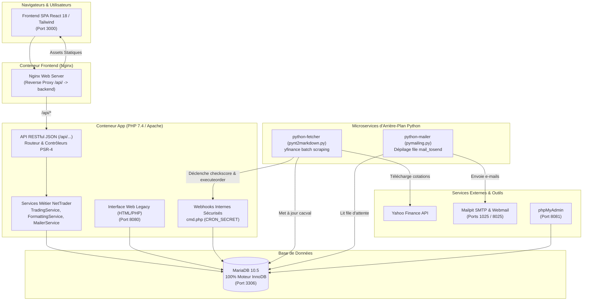

# NetTrader 2 — Plateforme & Jeu de Simulation Boursière

[](https://www.php.net/)
[](https://react.dev/)
[](https://www.typescriptlang.org/)
[](https://tailwindcss.com/)
[](https://www.docker.com/)
[](https://mariadb.org/)
[](https://www.python.org/)
[](#-tests-automatisés)

---

## 📈 Présentation du Projet

**NetTrader 2** est une plateforme de jeu et de simulation boursière complète, permettant à chacun de s'initier aux marchés financiers sans engager de capital réel.

Chaque joueur démarre avec un capital virtuel de **10 000 €** et doit bâtir la stratégie la plus performante pour grimper au classement général individuel ou par équipes.

### Points Clés du Jeu :
- **Cotations réelles en continu** : Intégration des cours réels (indices Euronext, actions internationales) avec un différé de 15 minutes, rafraîchis en continu.
- **Gestion des ordres de bourse** : Ordres au marché, à cours limité, et à seuils / plages de déclenchement.
- **Règles financières réalistes** : Frais de courtage et taxes proportionnelles, calcul des plus ou moins-values latentes et réalisées.
- **3 Niveaux d'expertise** :
  - *Débutant* : Achat et vente au comptant de titres en portefeuille.
  - *Initié* : Déblocage des ordres à cours limité et à seuils.
  - *Expert* : Vente à découvert (VAD) et effet de levier sur marge disponible.
- **Dimension Communautaire & Sociale** : Classements dynamiques, création et adhésion à des équipes (groupes), messagerie privée entre traders, et forums de discussion avec modération intégrée.

---

## 🏛️ Architecture du Système

Le projet a fait l'objet d'une **refonte et modernisation majeure**, transformant l'application monolithique historique (PHP procédural, MySQL MyISAM, client desktop VB6) en une **architecture moderne multi-conteneurs** découplée :



---

## 🚀 Récapitulatif des Évolutions & Refontes Récentes

### 1. Nouvelle Application Frontend (SPA React / TypeScript / Tailwind)
- **Stack moderne** : React 18, TypeScript, Tailwind CSS, Lucide Icons, Vite, Nginx.
- **Routage complet & Expérience fluide** :
  - **Accueil & Marchés** : Ticker boursier animé, vue d'ensemble du marché, top hausses / baisses.
  - **Fiche Valeur & Graphiques** : Cotation en temps réel, détails financiers et graphiques d'évolution interactifs.
  - **Portefeuille & Trading** : Valorisation totale, liquidités disponibles, tableau des positions, modal interactif d'achat/vente avec simulation des frais et contrôle des contraintes par niveau.
  - **Ordres en attente & Historique** : Suivi des ordres en carnet, annulation unitaire ou globale, historique des transactions et des profits/pertes.
  - **Classements** : Palmarès des meilleurs traders et classement des équipes.
  - **Forums & Discussions** : Rubriques thématiques, affichage des sujets, éditeur de messages avec support du BBCode (liens, citations, formatage) et gestion modérateur/administrateur.
  - **Messagerie & Profil** : Messagerie privée interne, gestion des paramètres, réinitialisation de compte et changement sécurisé de mot de passe.
  - **Administration Complète** : Dashboard d'administration, synchronisation des ordres, modération du forum, **Catalogue & Gestion des Actions** (création, édition, blocage d'achat, opérations de split/regroupement sur les portefeuilles, suppression sécurisée) et **espace dédié au suivi des cotations (Market Sync Monitor)** avec indicateurs en direct (taux de succès, détection des échecs consécutifs, nombre de retries, journal des cycles de mise à jour, filtres, recherche, et actions d'activation/désactivation ou réinitialisation d'erreurs).

### 2. Architecture Backend PSR-4 & API REST JSON Unifiée
- **Autoloading PSR-4** configuré via Composer (`NetTrader\` pointant vers `www/src/`).
- **Couche d'Accès aux Données Découplée (Repositories / DAL)** :
  - `StockRepository` : Cotations, variations, catalogue d'administration, filtres et monitoring.
  - `OrderRepository` : Carnet d'ordres, passage, annulations, calcul des volumes engagés.
  - `PortfolioRepository` : Positions, PRU, valorisation globale et historique financier.
  - `UserRepository` : Profils, liquidités (cashback), mots de passe, sessions et classements.
  - `ForumRepository` : Sections, rubriques, sujets, messages et synchronisation des compteurs.
- **Services Métier Découplés** :
  - `TradingService` : règles de négociation, validation des ordres, calculs de taxes, gestion de la VAD, vérification des marges et liquidités.
  - `FormattingService` : parseur BBCode sécurisé, conversion numérique/devises, formatage des dates.
  - `MailerService` : gestion et mise en file d'attente asynchrone des notifications e-mail.
  - `Database` : abstraction centralisée des requêtes préparées PDO.
  - `Request` & `UserSession` : gestion orientée objet des requêtes HTTP et de l'état de session utilisateur.
- **Routeur & Contrôleurs REST sous `/api/`** :
  - `/api/auth/*` : Authentification, inscription, session courante (`/me`), réinitialisation de mot de passe.
  - `/api/trading/*` : Portefeuille, carnet d'ordres (GET/POST/DELETE), simulation d'ordre, historique.
  - `/api/market/*` : Résumé du marché, liste des valeurs, détail d'un titre.
  - `/api/leaderboard/*` : Classements joueurs et équipes.
  - `/api/account/*` : Profil, mot de passe, remise à zéro du capital.
  - `/api/teams/*` : Consultation, création, adhésion et départ d'équipe.
  - `/api/messages/*` : Boîte de réception, envoi, suppression.
  - `/api/forums/*` : Rubriques, sujets, messages et création de posts.
  - `/api/admin/*` : Tableau de bord, modération du forum, gestion des joueurs, exécution des ordres.
  - `/api/admin/stocks/*` : Listing paginé du catalogue, recherche, métadonnées, création (POST), mise à jour (PUT), suppression (DELETE), bascule d'achat (`toggle-buy`), et opérations sur titres (`split`).
  - `/api/admin/market-sync/*` : Vue d'ensemble du marché (`overview`), listing paginé des cotations avec filtres (`stocks`), basculement de suivi (`toggle-track`) et réinitialisation d'erreurs unitaire ou globale (`reset-errors`, `reset-all-errors`).

### 3. Durcissement & Sécurité Critique (Phases P1 à P6)
- **100% Requêtes Préparées PDO** : Éradication totale des vulnérabilités d'injection SQL sur l'ensemble du code source (authentification, transactions, ordres, forums, admin). Dépréciation de l'ancienne fonction `sec()`.
- **Transactions ACID & Verrous Pessimistes** : Utilisation de `beginTransaction()`, `commit()`, `rollBack()` et de clauses `SELECT ... FOR UPDATE` sur les comptes et portefeuilles pour empêcher tout dépassement de liquidités ou d'actions en cas de requêtes concurrentes (*race conditions*).
- **Hachage BCRYPT & Migration Transparente** : Remplacement du hachage historique MD5 par `password_hash(..., PASSWORD_BCRYPT)`. Migration automatique et transparente des mots de passe des utilisateurs existants dès leur prochaine connexion.
- **Protection XSS Systématique** : Échappement systématique avec le helper global `e()` (`htmlspecialchars`), assainissement strict du parseur BBCode (neutralisation des pseudo-protocoles `javascript:`, filtrage des attributs).
- **Sessions Sécurisées CSPRNG** : Génération de jetons de session cryptographiquement sûrs (`random_bytes(32)` / 64 caractères hexadécimaux), cookies `HttpOnly` / `SameSite=Lax`, et révocation immédiate des sessions actives lors d'un changement de mot de passe.
- **Protection des Webhooks et Tâches de Fond** : Sécurisation de `cmd.php` (`checkscore`, `executeorder`) avec obligation d'authentification par clé secrète partagée `CRON_SECRET` (`X-Cron-Key` ou paramètre sécurisé avec `hash_equals`).
- **Protection contre l'Open Redirect** : Whitelist stricte des domaines autorisés dans `redir.php`.
- **Politique CORS Restreinte** : Autorisation explicite des origines légitimes (`localhost:3000`, `FRONTEND_URL`) avec en-tête `Vary: Origin`.
- **Suppression du Client VB6 Obsolète** : Suppression des anciens scripts d'API XML (`prog.php`, `progfunc.php`, `progreq.php`) renvoyant désormais un code HTTP 404.
- **Isolation du Répertoire de Tests** : Protection d'accès web direct à `www/tests/` via configuration `.htaccess` (HTTP 403).
- **Migration Intégrale vers InnoDB** : Conversion de 100% des tables de la base de données vers le moteur relationnel et transactionnel InnoDB.

### 4. Microservice de Cotation Boursière (`python-fetcher`)
- Scraping en continu des cotations réelles via la librairie **`yfinance`** en Python 3.
- Traitement optimisé par lots de 50 symboles avec repli unitaire automatique.
- **Règle métier de haute disponibilité** : Résilience des symboles (aucun symbole n'est désactivé automatiquement en cas de défaillance réseau temporaire de l'API externe).
- Détection d'anomalies de cours ($\ge 25\%$) avec alertes e-mail automatiques vers les administrateurs.
- Déclenchement automatique des calculs de portefeuilles et de l'exécution des ordres via `cmd.php`.

---

## 📦 Démarrage Rapide avec Docker

### Prérequis
- [Docker](https://docs.docker.com/get-docker/) (version 20.10+)
- [Docker Compose](https://docs.docker.com/compose/) (version 2.0+)

### 1. Lancement de la Stack Complète
Clonez le dépôt et démarrez tous les conteneurs en arrière-plan :

```bash
git clone https://github.com/tetrok/nettrader.git
cd nettrader
docker compose up -d
```

### 2. URL et Services Disponibles

| Service | Rôle | URL / Port | Identifiants par défaut |
| :--- | :--- | :--- | :--- |
| **Frontend SPA** | Interface utilisateur moderne React 18 | [http://localhost:3000](http://localhost:3000) | — |
| **Backend & API** | Serveur Apache / PHP 7.4 & API REST | [http://localhost:8080](http://localhost:8080) | — |
| **phpMyAdmin** | Administration visuelle de la base MariaDB | [http://localhost:8081](http://localhost:8081) | Utilisateur : `root` / Mot de passe : `rootpassword` |
| **Mailpit Web UI** | Visualiseur d'e-mails pour le développement | [http://localhost:8025](http://localhost:8025) | — |
| **Mailpit SMTP** | Serveur SMTP interne pour les e-mails | `localhost:1025` | Sans authentification |
| **MariaDB** | Serveur de base de données relationnelle | `localhost:3306` | Base : `nettrader`, User : `nettrader_user`, Pass : `nettrader_password` |

---

## 🧪 Tests Automatisés

Une suite complète de **46 tests d'intégration et de sécurité** est intégrée au projet. Elle valide le fonctionnement des règles métier, des contrôles d'accès, de l'API REST et des mécanismes de durcissement.

Pour exécuter la suite de tests dans le conteneur applicatif :

```bash
docker compose exec -T app php /var/www/html/tests/test_api_controls.php
```

### Couverture des Tests :
- **Règles Métier `TradingService`** : Refus de vente d'actions non possédées, blocage des ordres hors plage pour les débutants, vérification stricte du solde de liquidités, engagement des actions en carnet d'ordres.
- **Endpoints REST Trading** : Validation des codes HTTP 400 sur requêtes invalides, annulation d'ordres 404/200.
- **Gestion des Comptes & Profils** : Préservation des données non fournies, validation des niveaux, vérification de l'ancien mot de passe, révocation immédiate des sessions annexes.
- **Gestion des Équipes & Messagerie** : Validation des contraintes de taille, invitations de groupe, prévention de l'envoi de message à soi-même, protection contre les caractères spéciaux.
- **Parseur BBCode & Forums** : Support des syntaxes d'URL, citations, neutralisation des vecteurs d'attaque XSS `javascript:`.
- **Modération & Administration** : Contrôles de permissions strictes (HTTP 403 aux utilisateurs non-admin), création, édition, synchronisation des compteurs et suppression de rubriques/sujets.
- **Sécurité & Durcissement** : Suppression des routes VB6 (HTTP 404), authentification obligatoire par clé secrète sur `cmd.php` (HTTP 403), interdiction d'accès web au dossier `tests/`, entropie des jetons de session (CSPRNG 256 bits), migration 100% InnoDB, politique CORS restrictive et protection contre l'Open Redirect.
- **Suivi des Cotations & Supervision Marché (Market Sync)** : Rejet HTTP 403 pour non-administrateurs, consultation de la vue d'ensemble (KPIs et logs récents), listing paginé avec indicateurs de statut, filtrage par statut (`failed`, `success`, `pending`), réinitialisation unitaire et globale des compteurs d'échecs, basculement dynamique du suivi d'un titre (`toggle-track`).

---

## 📁 Structure du Répertoire

```text
.
├── docker-compose.yml          # Définition de l'ensemble des conteneurs
├── Dockerfile                  # Image Docker PHP 7.4 / Apache / msmtp / pdo_mysql
├── mysql_dump.sql              # Schéma de base de données et données initiales (InnoDB)
├── .jules/                     # Documentation technique détaillée, plans et audits
│   ├── plan.md                 # Feuille de route et suivi d'avancement
│   ├── dette.md                # Inventaire des dettes techniques
│   ├── api-fonctionnalites.md  # Spécifications des flux et des fonctionnalités
│   ├── faille-xss.md           # Rapport de remédiation des failles XSS
│   └── failles-injections.md   # Rapport de remédiation des injections SQL
├── frontend/                   # Application SPA React / TypeScript
│   ├── src/
│   │   ├── api/                # Clients d'API typés (auth, trading, forums, admin...)
│   │   ├── components/         # Composants d'interface (Navbar, OrderModal, StockChart...)
│   │   ├── context/            # Contexte d'authentification (AuthContext)
│   │   ├── pages/              # Pages de l'application (Portfolio, Market, Forums...)
│   │   └── router.tsx          # Configuration des routes et guards d'authentification
│   ├── nginx.conf              # Configuration Nginx et reverse proxy /api/
│   └── Dockerfile              # Multi-stage build Node -> Nginx
├── pythonfetch/                # Microservices d'arrière-plan Python
│   ├── pynt2markdown.py        # Récupération des cours Yahoo Finance et synchronisation
│   ├── pymailing.py            # Traitement de la file d'envoi d'e-mails
│   ├── pynt2stats.py           # Calcul des statistiques de jeu
│   └── Dockerfile              # Image Python 3 avec yfinance, pandas, pymysql
├── www/                        # Code source Backend PHP
│   ├── api/                    # Passerelle de l'API REST JSON
│   │   └── index.php           # Routeur principal de l'API REST
│   ├── src/                    # Classes PSR-4 (NetTrader\...)
│   │   ├── Api/                # Contrôleurs REST (AuthController, TradingController...)
│   │   ├── Auth/               # Gestion des sessions et authentification (UserSession)
│   │   ├── Database/           # Abstraction PDO centralisée (Database)
│   │   ├── Http/               # Abstraction des requêtes (Request)
│   │   └── Service/            # Services métier (TradingService, FormattingService...)
│   ├── tests/                  # Suite de tests automatisés
│   │   ├── test_api_controls.php
│   │   └── .htaccess           # Protection d'accès web direct
│   ├── autoload.php            # Autoloader PSR-4
│   ├── cmd.php                 # Point d'entrée interne sécurisé pour les tâches de fond
│   ├── redir.php               # Script de redirection sécurisé contre l'Open Redirect
│   ├── db_connect.php          # Initialisation PDO
│   ├── db_reqfunction.php      # Fonctions métier et requêtes SQL préparées
│   └── index.php               # Front Controller de l'interface legacy PHP
└── nettrader2Client/           # Code source historique du client VB6 (archivé)
```

---

## 📚 Documentation Additionnelle

Pour approfondir les aspects d'architecture et de sécurité, consultez les documents du répertoire [`.jules/`](.jules/) :
- [`.jules/plan.md`](.jules/plan.md) : Plan d'action détaillé et matrice de suivi des chantiers.
- [`.jules/dette.md`](.jules/dette.md) : État des lieux de la dette technique et résolutions effectuées.
- [`.jules/api-fonctionnalites.md`](.jules/api-fonctionnalites.md) : Architecture des flux et spécification détaillée des fonctionnalités.
- [`.jules/failles-injections.md`](.jules/failles-injections.md) : Détail de la remédiation systématique des injections SQL.
- [`.jules/faille-xss.md`](.jules/faille-xss.md) : Stratégie d'assainissement et protection contre les attaques XSS.

---

## 📄 Licence

Ce projet est distribué sous la licence spécifiée dans le fichier [LICENSE](LICENSE).
